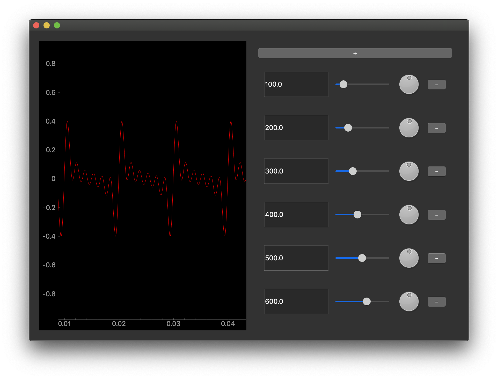

# Sine Wave Audio Synthesis UI Demo

This repository contains a simple audio synthesiser using numpy and PyAudio to play various waveforms.

Also included is a visualisation UI using pyqtgraph and PyQt5. Add together multiple sine waves with individually configureable frequency and volume, and see and hear the resulting waveform.




## Installation

Make sure you have python 3.6 and pipenv installed.

Download or clone this repository, navigate inside and run:

`pipenv install`

## Usage

Run the UI using:

`pipenv run ui`

Press the '+' button to add a new sinewave, use the text input or the slider to change the frequency and the dial to change the local volume. Press the '-' button next to a frequency selector to remove it.

To see some preset examples, try any of the following:

```shell
pipenv run ui full     # show the full harmonic series
pipenv run ui odd      # show the odd harmonic series
pipenv run ui square   # show a square wave approximation
pipenv run ui triangle # show a triangle wave approximation
pipenv run ui sawtooth # show a sawtooth wave approximation

# the default fundamental of the above is 100Hz.
# combine any preset with a frequency to change this, e.g.
pipenv run square 250
```


You can also use the synthesiser on its own, without the UI, as follows:

```python
from synth import Synth

# Specify notes as a list of sinewave frequencies in Hz
notes = [100, 150, 250]

# Specify volumes for each note as a list between 0 and 1
volumes = [1, 0.75, 0.5]

update_rate = 1  # how many audio frames generated per second
# A high value will let the notes change more frequently,
# but might cause "popping" sounds for complex waveforms.
# A low value tends to have fewer "popping" sounds, but
# won't update to a new note as quickly

# initialise the synth with specific notes
synth = Synth(notes, volumes, update_hz=update_rate)

# start the continuous playback
synth.start()

# change the notes dynamically
input('Press Enter to change chord')

synth.notes = [150, 200, 350]

# control the main output volume scaling
synth.master_volume = 0.75

# prevent the application from terminating
input('Press Enter to end')

# close the audio thread and end the program
synth.stop()
```
